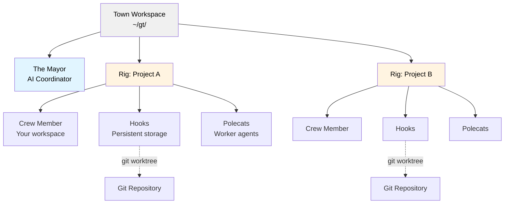
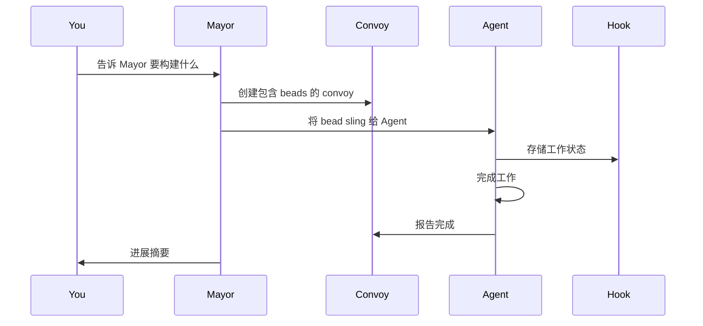
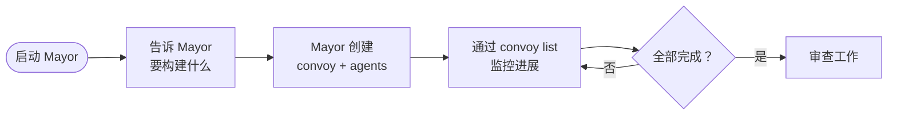
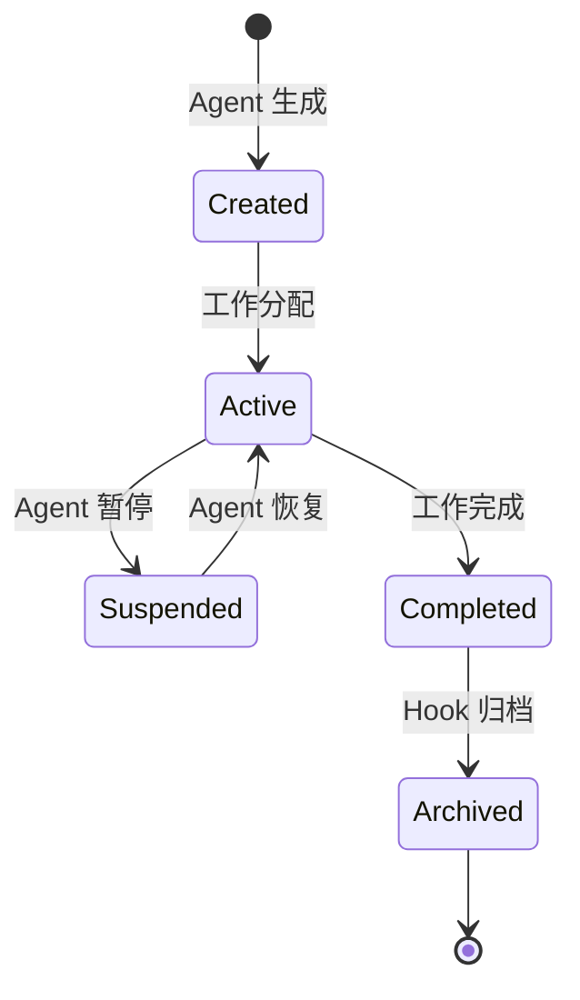

# Gas Town

**面向 Claude Code、GitHub Copilot 及其他 AI Agent 的多 Agent 编排系统，具备持久化工作追踪**

## 概述

Gas Town 是一个工作空间管理器，让你能够协调多个 AI 编程 Agent（Claude Code、GitHub Copilot、Codex、Gemini 等）处理不同任务。当 Agent 重启时不会丢失上下文，Gas Town 将工作状态持久化在基于 git 的 hook 中，实现可靠的多 Agent 工作流。

### 这解决了什么问题？

| 挑战 | Gas Town 的解决方案 |
| --- | --- |
| Agent 重启时丢失上下文 | 工作持久化在基于 git 的 hook 中 |
| 手动协调 Agent | 内置邮箱、身份标识和交接机制 |
| 4-10 个 Agent 变得混乱 | 轻松扩展到 20-30 个 Agent |
| 工作状态丢失在 Agent 记忆中 | 工作状态存储在 Beads 账本中 |

### 架构



## 核心概念

### The Mayor

你的主要 AI 协调器。Mayor 是一个拥有你工作空间、项目和 Agent 完整上下文的 Claude Code 实例。**从这里开始**——只需告诉 Mayor 你想要完成什么。

### Town

你的工作空间目录（如 `~/gt/`）。包含所有项目、Agent 和配置。

### Rigs

项目容器。每个 Rig 包装一个 git 仓库并管理其关联的 Agent。

### Crew Members

你在 Rig 内的个人工作空间，用于亲自动手工作。

### Polecats

拥有持久身份但会话短暂的 Worker Agent。为任务而生，会话在完成时结束，但身份和工作历史持久保留。

### Hooks

基于 Git worktree 的 Agent 工作持久化存储。在崩溃和重启后仍然存活。

### Convoys

工作追踪单元。将多个 Bead 打包并分配给 Agent。标记为 `mountain` 的 Convoy 会获得自主停滞检测和智能跳过逻辑，适合史诗级规模的执行。

### Beads 集成

基于 Git 的 Issue 追踪系统，将工作状态存储为结构化数据。

**Bead ID**（也称 **Issue ID**）使用前缀 + 5 字符字母数字格式（如 `gt-abc12`、`hq-x7k2m`）。前缀表示条目的来源或 Rig。`gt sling` 和 `gt convoy` 等命令接受这些 ID 来引用特定的工作条目。"bead" 和 "issue" 两词可互换使用——bead 是底层数据格式，而 issue 是以 bead 形式存储的工作条目。

### Molecules

协调多步骤工作的工作流模板。Formula（TOML 定义）被实例化为带有追踪步骤的 Molecule。两种模式：仅 root 的 wisp（步骤在运行时物化，轻量级）和 poured wisp（步骤作为子 wisp 物化，支持检查点恢复）。参见 [Molecules](docs/concepts/molecules.md)。

### 监控：Witness、Deacon、Dogs

三层看门狗系统保持 Agent 健康：

- **Witness** - 每 Rig 的生命周期管理器。监控 Polecat、检测卡住的 Agent、触发恢复、管理会话清理。
- **Deacon** - 跨 Rig 的后台监控器，持续运行巡逻周期。
- **Dogs** - 由 Deacon 派遣执行维护任务的基础设施 Worker（如 Boot 负责分流）。

### Refinery

每 Rig 的合并队列处理器。当 Polecat 通过 `gt done` 完成工作时，Refinery 批量处理合并请求，运行验证关卡，并使用 Bors 风格的二分合并队列合并到 main。失败的 MR 被隔离，要么内联修复，要么重新派遣。

### Escalation

基于严重程度的 Issue 升级。遇到阻塞的 Agent 通过 `gt escalate` 升级，创建追踪 Bead，路由通过 Deacon、Mayor 和（如需要的）Overseer。严重级别：CRITICAL（P0）、HIGH（P1）、MEDIUM（P2）。参见 [Escalation](docs/design/escalation.md)。

### Scheduler

配置驱动的 Polecat 派遣容量控制器。通过在可配置的并发限制下批量派遣来防止 API 速率限制耗尽。默认为直接派遣；设置 `scheduler.max_polecats` 以启用通过守护进程的延迟派遣。参见 [Scheduler](docs/design/scheduler.md)。

### Seance

会话发现和延续。通过 `.events.jsonl` 日志发现之前的 Agent 会话，使 Agent 能够查询其前任的上下文和早期工作的决策。

```bash
gt seance                       # 列出可发现的前任会话
gt seance --talk <id> -p "What did you find?"  # 一次性提问
```

### Wasteland

通过 DoltHub 连接 Gas Town 的联邦工作协调网络。Rig 发布需求条目、从其他 Town 认领工作、提交完成证据，并通过多维 stamp 获得可移植声誉。参见 [Wasteland](docs/WASTELAND.md)。

> **Gas Town 新手？** 参见 [术语表](docs/glossary.md) 获取完整的术语和概念指南。

## 安装

### 前置条件

- **Go 1.25+** - [go.dev/dl](https://go.dev/dl/)
- **Git 2.25+** - 用于 worktree 支持
- **Dolt 1.82.4+** - [github.com/dolthub/dolt](https://github.com/dolthub/dolt)
- **beads (bd) 0.55.4+** - [github.com/steveyegge/beads](https://github.com/steveyegge/beads)
- **sqlite3** - 用于 Convoy 数据库查询（macOS/Linux 通常已预装）
- **tmux 3.0+** - 推荐安装以获得完整体验
- **Claude Code CLI**（默认运行时） - [claude.ai/code](https://claude.ai/code)
- **Codex CLI**（可选运行时） - [developers.openai.com/codex/cli](https://developers.openai.com/codex/cli)
- **GitHub Copilot CLI**（可选运行时） - [cli.github.com](https://cli.github.com)（需要 Copilot 席位）

### 安装步骤（Docker-Compose 方式见下文）

```bash
# 安装 Gas Town
$ brew install gastown                                    # Homebrew（推荐）
$ npm install -g @gastown/gt                              # npm
$ go install github.com/steveyegge/gastown/cmd/gt@latest  # 从源码编译（仅 Linux）

# macOS：go install 生成的二进制文件未签名，macOS 会 SIGKILL。
# 使用 brew install（上方）或克隆后通过 make 构建：
$ git clone https://github.com/steveyegge/gastown.git && cd gastown
$ make build && mv gt $HOME/go/bin/

# Windows（或 go install 失败时）：克隆后手动构建
$ git clone https://github.com/steveyegge/gastown.git && cd gastown
$ go build -o gt.exe ./cmd/gt
$ mv gt.exe $HOME/go/bin/  # 或将 gastown 添加到 PATH

# 如果使用 go install，将 Go 二进制目录添加到 PATH（添加到 ~/.zshrc 或 ~/.bashrc）
export PATH="$PATH:$HOME/go/bin"

# 创建工作空间并初始化 git
gt install ~/gt --git
cd ~/gt

# 添加你的第一个项目
gt rig add myproject https://github.com/you/repo.git

# 创建你的 Crew 工作空间
gt crew add yourname --rig myproject
cd myproject/crew/yourname

# 启动 Mayor 会话（你的主要接口）
gt mayor attach
```

### Docker Compose

```bash
export GIT_USER="<your name>"
export GIT_EMAIL="<your email>"
export FOLDER="/Users/you/code"
export DASHBOARD_PORT=8080  # 可选，Web 仪表盘的主机端口

docker compose build              # 仅在首次运行或代码变更后需要
docker compose up -d

docker compose exec gastown zsh   # 或 bash

gt up

gh auth login                     # 如果你需要 gh 可用

gt mayor attach
```

## 快速入门指南

### 开始使用
运行
```shell
gt install ~/gt --git &&
cd ~/gt &&
gt config agent list &&
gt mayor attach
```
然后告诉 Mayor 你想要构建什么！

---

### 基本工作流



### 示例：功能开发

```bash
# 1. 启动 Mayor
gt mayor attach

# 2. 在 Mayor 会话中，创建带有 bead ID 的 convoy
gt convoy create "Feature X" gt-abc12 gt-def34 --notify --human

# 3. 将工作分配给 Agent
gt sling gt-abc12 myproject

# 4. 追踪进展
gt convoy list

# 5. 监控 Agent
gt agents
```

## 常见工作流

### Mayor 工作流（推荐）

**最适合：** 协调复杂的多 Issue 工作



**命令：**

```bash
# 连接到 Mayor
gt mayor attach

# 在 Mayor 中，创建 convoy 让它自动编排
gt convoy create "Auth System" gt-x7k2m gt-p9n4q --notify

# 追踪进展
gt convoy list
```

### 最小模式（无 Tmux）

手动运行各个运行时实例。Gas Town 仅追踪状态。

```bash
gt convoy create "Fix bugs" gt-abc12   # 创建 convoy（如跳过 sling 会自动创建）
gt sling gt-abc12 myproject            # 分配给 worker
claude --resume                        # Agent 读取邮件、执行工作（Claude）
# 或: codex                            # 在工作空间启动 Codex
gt convoy list                         # 检查进展
```

### Beads Formula 工作流

**最适合：** 预定义的、可重复的流程

Formula 是嵌入在 `gt` 二进制文件中的 TOML 定义工作流（源码在 `internal/formula/formulas/`）。

**Formula 示例**（`internal/formula/formulas/release.formula.toml`）：

```toml
description = "Standard release process"
formula = "release"
version = 1

[vars.version]
description = "The semantic version to release (e.g., 1.2.0)"
required = true

[[steps]]
id = "bump-version"
title = "Bump version"
description = "Run ./scripts/bump-version.sh {{version}}"

[[steps]]
id = "run-tests"
title = "Run tests"
description = "Run make test"
needs = ["bump-version"]

[[steps]]
id = "build"
title = "Build"
description = "Run make build"
needs = ["run-tests"]

[[steps]]
id = "create-tag"
title = "Create release tag"
description = "Run git tag -a v{{version}} -m 'Release v{{version}}'"
needs = ["build"]

[[steps]]
id = "publish"
title = "Publish"
description = "Run ./scripts/publish.sh"
needs = ["create-tag"]
```

**执行：**

```bash
# 列出可用的 formula
bd formula list

# 使用变量运行 formula
bd cook release --var version=1.2.0

# 创建 formula 实例以便追踪
bd mol pour release --var version=1.2.0
```

### 手动 Convoy 工作流

**最适合：** 直接控制工作分配

```bash
# 手动创建 convoy
gt convoy create "Bug Fixes" --human

# 向已有 convoy 添加 issue
gt convoy add hq-cv-abc gt-m3k9p gt-w5t2x

# 分配给特定 Agent
gt sling gt-m3k9p myproject/my-agent

# 检查状态
gt convoy show
```

## 运行时配置

Gas Town 支持多种 AI 编程运行时。每个 Rig 的运行时设置在 `settings/config.json` 中。

```json
{
  "runtime": {
    "provider": "codex",
    "command": "codex",
    "args": [],
    "prompt_mode": "none"
  }
}
```

**注意：**

- Claude 使用 `.claude/settings.json` 中的 hook（通过 `--settings` 标志管理）进行邮件注入和启动。
- 对于 Codex，在 `~/.codex/config.toml` 中设置 `project_doc_fallback_filenames = ["CLAUDE.md"]`，以便角色指令被正确加载。
- 对于没有 hook 的运行时（如 Codex），Gas Town 在会话就绪后发送启动回退：
  `gt prime`，可选 `gt mail check --inject`（用于自主角色），以及 `gt nudge deacon session-started`。
- **GitHub Copilot**（`copilot`）是一个内置预设，使用 `--yolo` 进入自主模式。它使用 `.github/hooks/gastown.json` 中的可执行生命周期 hook（与 Claude 相同的事件：`sessionStart`、`userPromptSubmitted`、`preToolUse`、`sessionEnd`）。使用 5 秒就绪延迟替代提示检测。需要 Copilot 席位和组织级 CLI 策略。参见 [docs/INSTALLING.md](docs/INSTALLING.md)。

## 关键命令

### 工作空间管理

```bash
gt install <path>           # 初始化工作空间
gt rig add <name> <repo>    # 添加项目
gt rig list                 # 列出项目
gt crew add <name> --rig <rig>  # 创建 Crew 工作空间
```

### Agent 操作

```bash
gt agents                   # 列出活跃 Agent
gt sling <bead-id> <rig>    # 将工作分配给 Agent
gt sling <bead-id> <rig> --agent cursor   # 为此 sling/spawn 覆盖运行时
gt mayor attach             # 启动 Mayor 会话
gt mayor start --agent auggie           # 使用指定 Agent 别名运行 Mayor
gt prime                    # 上下文恢复（在已有会话内运行）
gt feed                     # 实时活动流（TUI）
gt feed --problems          # 以问题视图启动（卡住 Agent 检测）
```

**内置 Agent 预设**：`claude`、`gemini`、`codex`、`cursor`、`auggie`、`amp`、`opencode`、`copilot`、`pi`、`omp`

### Convoy（工作追踪）

```bash
gt convoy create <name> [issues...]   # 创建包含 issue 的 convoy
gt convoy list              # 列出所有 convoy
gt convoy show [id]         # 显示 convoy 详情
gt convoy add <convoy-id> <issue-id...>  # 向 convoy 添加 issue
```

### 配置

```bash
# 设置自定义 Agent 命令
gt config agent set claude-glm "claude-glm --model glm-4"
gt config agent set codex-low "codex --thinking low"

# 设置默认 Agent
gt config default-agent claude-glm
```

### 监控与健康

```bash
gt escalate -s HIGH "description"  # 升级一个阻塞问题
gt escalate list               # 列出开放的升级
gt scheduler status            # 显示调度器状态
gt seance                      # 发现之前的会话
gt seance --talk <id>          # 查询前任会话
```

### Beads 集成

```bash
bd formula list             # 列出 formula
bd cook <formula>           # 执行 formula
bd mol pour <formula>       # 创建可追踪实例
bd mol list                 # 列出活跃实例
```

### Wasteland 联邦

```bash
gt wl join <remote>            # 加入一个 wasteland
gt wl browse                   # 查看需求看板
gt wl claim <id>               # 认领工作
gt wl done <id> --evidence <url>  # 提交完成证据
```

## 执行 Formula

Gas Town 包含用于常见工作流的内置 Formula。可用配方参见 `internal/formula/formulas/`。

## 活动流

`gt feed` 启动一个交互式终端仪表盘，用于实时监控所有 Agent 活动。它将 Beads 活动、Agent 事件和合并队列更新组合成三面板 TUI：

- **Agent 树** - 按 Rig 和角色分组的所有 Agent 层级视图
- **Convoy 面板** - 进行中和最近完成的 Convoy
- **事件流** - 创建、完成、sling、nudge 等事件的时间顺序流

```bash
gt feed                      # 启动 TUI 仪表盘
gt feed --problems           # 以问题视图启动
gt feed --plain              # 纯文本输出（无 TUI）
gt feed --window             # 在专用 tmux 窗口中打开
gt feed --since 1h           # 最近一小时的事件
```

**导航**：`j`/`k` 滚动，`Tab` 切换面板，`1`/`2`/`3` 跳转到面板，`?` 帮助，`q` 退出。

### 问题视图

在规模较大时（20-50+ Agent），在活动流中发现卡住的 Agent 变得困难。问题视图通过分析结构化 Beads 数据来展示需要人工干预的 Agent。

在 `gt feed` 中按 `p`（或使用 `gt feed --problems` 启动）切换问题视图，按健康状态分组展示 Agent：

| 状态 | 条件 |
|------|------|
| **GUPP 违规** | Hook 上的工作长时间无进展 |
| **停滞** | Hook 上的工作进展减缓 |
| **僵尸** | tmux 会话已死 |
| **工作中** | 活跃，正常推进 |
| **空闲** | 无 Hook 上的工作 |

**干预按键**（问题视图中）：`n` 向选中 Agent 发送 nudge，`h` 执行 handoff（刷新上下文）。

## 仪表盘

Gas Town 包含一个 Web 仪表盘用于监控你的工作空间。仪表盘必须从 Gas Town 工作空间（HQ）目录内运行。

```bash
# 启动仪表盘（默认端口 8080）
gt dashboard

# 使用自定义端口启动
gt dashboard --port 3000

# 启动并自动在浏览器中打开
gt dashboard --open
```

仪表盘提供你工作空间中所有活动的单页概览：Agent、Convoy、Hook、队列、Issue 和升级。它通过 htmx 自动刷新，并包含命令面板，可直接从浏览器运行 gt 命令。

## 监控与健康

Gas Town 使用三层看门狗链在大规模下保持 Agent 健康：

```
Daemon (Go 进程) ← 每 3 分钟心跳
    └── Boot (AI agent) ← 智能分流
        └── Deacon (AI agent) ← 持续巡逻
            └── Witnesses & Refineries ← 每 Rig 的 Agent
```

### Witness（每 Rig）

每个 Rig 有一个 Witness 监控其 Polecat。Witness 检测卡住的 Agent、触发恢复（nudge 或 handoff）、管理会话清理和追踪完成。Witness 委派工作而非直接执行。

### Deacon（跨 Rig）

Deacon 在所有 Rig 上持续运行巡逻周期，检查 Agent 健康、为维护任务派遣 Dog，以及升级单个 Witness 无法解决的问题。

### Escalation

当 Agent 遇到阻塞时，它们选择升级而非等待：

```bash
gt escalate -s HIGH "Description of blocker"
gt escalate list                    # 列出开放的升级
gt escalate ack <bead-id>           # 确认一个升级
```

升级按严重程度路由：Deacon -> Mayor -> Overseer。参见 [Escalation 设计](docs/design/escalation.md)。

## 合并队列（Refinery）

Refinery 通过二分合并队列处理 Polecat 完成的工作：

1. Polecat 运行 `gt done` -> 分支被推送，创建 MR bead
2. Refinery 批量处理待处理的 MR
3. 在合并后的堆栈上运行验证关卡
4. 如果通过：批次中所有 MR 合并到 main
5. 如果失败：二分法隔离失败的 MR，合并通过的 MR

这是 Bors 风格的合并队列——Polecat 永远不会直接推送到 main。

## Scheduler

Scheduler 控制 Polecat 的派遣容量以防止 API 速率限制耗尽：

```bash
gt config set scheduler.max_polecats 5   # 启用延迟派遣（最多 5 个并发）
gt scheduler status                      # 显示调度器状态
gt scheduler pause                       # 暂停派遣
gt scheduler resume                      # 恢复派遣
```

默认模式（`max_polecats = -1`）通过 `gt sling` 立即派遣。设置限制后，守护进程将逐步派遣，遵守容量限制。参见 [Scheduler 设计](docs/design/scheduler.md)。

## Seance

发现和查询之前的 Agent 会话：

```bash
gt seance                              # 列出可发现的前任会话
gt seance --talk <id>                  # 与前任的完整上下文对话
gt seance --talk <id> -p "Question?"   # 向前任一次性提问
```

Seance 通过 `.events.jsonl` 日志发现会话，使 Agent 能够恢复上下文和早期工作的决策，而无需重新阅读整个代码库。

## Wasteland 联邦

Wasteland 是通过 DoltHub 连接多个 Gas Town 的联邦工作协调网络：

```bash
gt wl join hop/wl-commons              # 加入一个 wasteland
gt wl browse                           # 查看需求看板
gt wl claim <id>                       # 认领一个需求条目
gt wl done <id> --evidence <url>       # 提交完成证据
gt wl post --title "Need X"            # 发布新需求条目
```

完成工作可获得通过多维 stamp（质量、速度、复杂度）的可移植声誉。参见 [Wasteland 指南](docs/WASTELAND.md)。

## 遥测（OpenTelemetry）

Gas Town 将所有 Agent 操作作为结构化日志和指标发送到任何兼容 OTLP 的后端（默认为 VictoriaMetrics/VictoriaLogs）：

```bash
# 配置 OTLP 端点
export GT_OTEL_LOGS_URL="http://localhost:9428/insert/jsonline"
export GT_OTEL_METRICS_URL="http://localhost:8428/api/v1/write"
```

**发送的事件**：会话生命周期、Agent 状态变更、bd 调用及耗时、邮件操作、sling/nudge/done 工作流、Polecat 生成/移除、formula 实例化、convoy 创建、守护进程重启等。

**包含的指标**：`gastown.session.starts.total`、`gastown.bd.calls.total`、`gastown.polecat.spawns.total`、`gastown.done.total`、`gastown.convoy.creates.total` 等。

完整的事件结构参见 [OTEL 数据模型](docs/otel-data-model.md) 和 [OTEL 架构](docs/design/otel/)。

## 高级概念

### 推进原则

Gas Town 使用 git hook 作为推进机制。每个 Hook 是一个具有以下特性的 git worktree：

1. **持久状态** - 工作在 Agent 重启后仍然存活
2. **版本控制** - 所有变更都在 git 中追踪
3. **回滚能力** - 可以恢复到任何之前的状态
4. **多 Agent 协调** - 通过 git 共享

### Hook 生命周期



### MEOW（Mayor-Enhanced Orchestration Workflow）

MEOW 是推荐的模式：

1. **告诉 Mayor** - 描述你想要什么
2. **Mayor 分析** - 拆分为任务
3. **Convoy 创建** - Mayor 创建包含 Bead 的 Convoy
4. **Agent 生成** - Mayor 生成适当的 Agent
5. **工作分配** - Bead 通过 Hook sling 给 Agent
6. **进展监控** - 通过 Convoy 状态追踪
7. **完成** - Mayor 汇总结果

## Shell 补全

```bash
# Bash
gt completion bash > /etc/bash_completion.d/gt

# Zsh
gt completion zsh > "${fpath[1]}/_gt"

# Fish
gt completion fish > ~/.config/fish/completions/gt.fish
```

## 项目角色

| 角色 | 描述 | 主要接口 |
| --- | --- | --- |
| **Mayor** | AI 协调器 | `gt mayor attach` |
| **Human（你）** | Crew 成员 | 你的 Crew 目录 |
| **Polecat** | Worker Agent | 由 Mayor 生成 |
| **Witness** | 每 Rig 的 Agent 健康监控器 | 自动巡逻 |
| **Deacon** | 跨 Rig 监控守护进程 | `gt patrol` |
| **Refinery** | 合并队列处理器 | 自动运行 |
| **Hook** | 持久化存储 | Git worktree |
| **Convoy** | 工作追踪器 | `gt convoy` 命令 |

## 提示

- **始终从 Mayor 开始** - 它是你的主要接口
- **使用 Convoy 协调** - 它们提供跨 Agent 的可见性
- **利用 Hook 持久化** - 你的工作不会丢失
- **为重复任务创建 Formula** - 用 Beads 配方节省时间
- **使用 `gt feed` 实时监控** - 观察 Agent 活动，尽早发现卡住的 Agent
- **监控仪表盘** - 在浏览器中获得实时可见性
- **让 Mayor 编排** - 它知道如何管理 Agent

## 设计文档

更深入的技术细节，参见 `docs/` 中的设计文档：

| 主题 | 文档 |
|------|------|
| 架构 | [docs/design/architecture.md](docs/design/architecture.md) |
| 术语表 | [docs/glossary.md](docs/glossary.md) |
| Molecules | [docs/concepts/molecules.md](docs/concepts/molecules.md) |
| Escalation | [docs/design/escalation.md](docs/design/escalation.md) |
| Scheduler | [docs/design/scheduler.md](docs/design/scheduler.md) |
| Wasteland | [docs/WASTELAND.md](docs/WASTELAND.md) |
| OTEL 数据模型 | [docs/otel-data-model.md](docs/otel-data-model.md) |
| Witness 设计 | [docs/design/witness-at-team-lead.md](docs/design/witness-at-team-lead.md) |
| Convoy 生命周期 | [docs/design/convoy/](docs/design/convoy/) |
| Polecat 生命周期 | [docs/design/polecat-lifecycle-patrol.md](docs/design/polecat-lifecycle-patrol.md) |
| 插件系统 | [docs/design/plugin-system.md](docs/design/plugin-system.md) |
| Agent 提供者 | [docs/agent-provider-integration.md](docs/agent-provider-integration.md) |
| Hook | [docs/HOOKS.md](docs/HOOKS.md) |
| 安装指南 | [docs/INSTALLING.md](docs/INSTALLING.md) |

## 故障排除

### Agent 失去连接

检查 Hook 是否正确初始化：

```bash
gt hooks list
gt hooks repair
```

### Convoy 卡住

强制刷新：

```bash
gt convoy refresh <convoy-id>
```

### Mayor 无响应

重启 Mayor 会话：

```bash
gt mayor detach
gt mayor attach
```

## 许可证

MIT License - 详见 LICENSE 文件