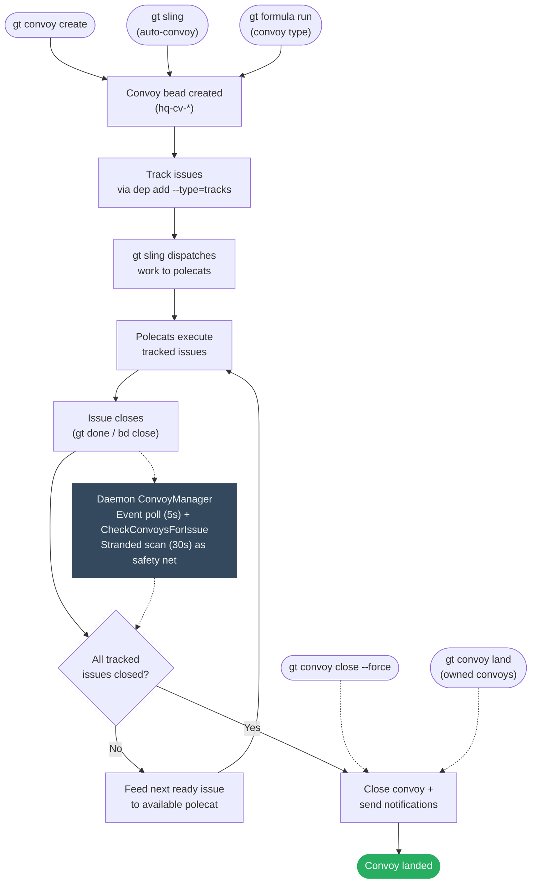
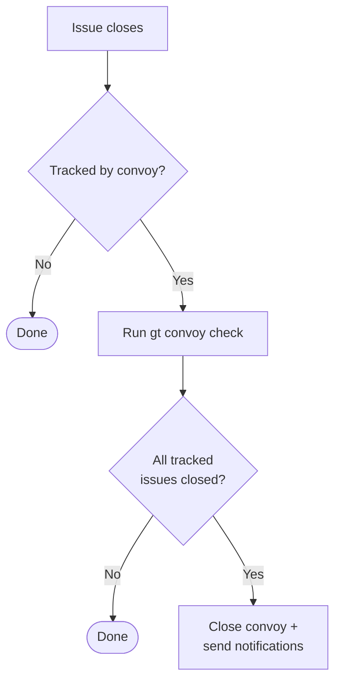

# Convoy 生命周期设计

> 使 convoy 主动收敛到完成。

## 流程



三条创建路径汇入同一生命周期。完成由 daemon 的 `ConvoyManager` 事件驱动，它运行两个 goroutine：

- **事件轮询**（每 5s）：通过 `GetAllEventsSince` 轮询所有 rig bead 存储 + hq，检测关闭事件，并调用 `convoy.CheckConvoysForIssue` — 既检查完成又为下一个就绪 issue 分配 polecat。
- **搁浅扫描**（每 30s）：运行 `gt convoy stranded --json` 捕获事件驱动路径遗漏的 convoy（如崩溃/重启后）。分派就绪工作或自动关闭空 convoy。

手动覆盖（`close --force`、`land`）完全绕过检查。

> **历史：** Witness 和 Refinery 观察者最初计划作为冗余观察者，但被移除（spec S-04、S-05）。Daemon 的多 rig 事件轮询 + 搁浅扫描提供了足够的覆盖。

---

## 自动 convoy 创建：`gt sling` 实际做了什么

`gt sling` 为其分派的每个 bead 自动创建 convoy，除非传递了 `--no-convoy`。单个 bead 和多 bead（批量）sling 的行为差异显著。

### 单 bead sling

```
gt sling sh-task-1 gastown
```

1. 检查 `sh-task-1` 是否已被开放 convoy 跟踪。
2. 如果未被跟踪：创建一个自动 convoy `"Work: <issue-title>"` 跟踪该单个 bead。
3. 生成一个 polecat，hook 该 bead，开始工作。

结果：1 个 bead，1 个 convoy，1 个 polecat。

### 批量 sling（3+ 参数，rig 自动解析）

```
gt sling gt-task-1 gt-task-2 gt-task-3
```

Rig 通过 `routes.jsonl` 从 bead 前缀自动解析（`sling_batch.go` 中的 `resolveRigFromBeadIDs`）。所有 bead 必须解析到同一 rig。显式 rig 参数仍然有效但打印弃用警告：

```
gt sling gt-task-1 gt-task-2 gt-task-3 gastown
# Deprecation: gt sling now auto-resolves the rig from bead prefixes.
#              You no longer need to explicitly specify <gastown>.
```

**批量 sling 创建一个跟踪所有 bead 的 convoy。** 在生成任何 polecat 之前，`runBatchSling`（`sling_batch.go`）调用 `createBatchConvoy`（`sling_convoy.go`），后者创建标题为 `"Batch: N beads to <rig>"` 的单个 convoy，并为所有 bead 添加 `tracks` 依赖。

结果：3 个 bead，**1 个 convoy**，3 个 polecat — 全部并行分派，生成间有 2 秒延迟。

Convoy ID 和合并策略通过 `beadFieldUpdates` 存储在每个 bead 上，以便 `gt done` 可以通过快速路径找到 convoy。

bead 数量无上限。`gt sling <10 beads>` 生成 10 个共享 1 个 convoy 的 polecat。唯一节流是 `--max-concurrent`（默认 0 = 无限制）。

### Rig 解析错误

当 rig 为显式指定时，跨 rig 守卫检查每个 bead 的前缀与目标 rig。不匹配时，会报错并提供批量特定的建议操作（移除该 bead、单独 sling、或 `--force`）。

自动解析时，`resolveRigFromBeadIDs` 在以下情况报错：
- bead 无有效前缀
- 前缀未在 `routes.jsonl` 中映射（包括 town 级别 `path="."`）
- bead 解析到不同 rig（列出每个 bead 的 rig，建议分开 sling）

### 已跟踪 bead 冲突

如果批量中任何 bead 已被另一个 convoy 跟踪，批量 sling 在生成任何 polecat **之前**报错。它打印：

- 哪个 bead 冲突以及它属于哪个 convoy
- 已有 convoy 中的所有 bead 及其状态
- 高亮冲突 bead
- 4 个建议操作（从批量中移除、移动 bead、关闭旧 convoy、添加到已有 convoy）

### 初始分派 vs daemon 喂养

- **初始分派是并行的。** 所有 bead 按顺序获得 polecat，生成间有 2 秒延迟，但它们都在同一次批量 sling 调用中分派，不关心依赖。即使 `gt-task-2` 有对 `gt-task-1` 的 `blocks` 依赖，两者都会被 sling。`isIssueBlocked` 检查仅适用于 daemon 驱动的 convoy 喂养（关闭事件后），不适用于初始批量 sling 分派。
- **后续喂养尊重依赖。** 当任务关闭时，daemon 的事件驱动 feeder 在分派共享 convoy 中的下一个就绪 issue 前检查 `IsSlingableType` 和 `isIssueBlocked`。

### 无 convoy 模式

带 `--no-convoy` 的批量 sling 完全跳过 convoy 创建：

```
gt sling gt-task-1 gt-task-2 gt-task-3 gastown --no-convoy
```

---

## 问题陈述

Convoy 是被动跟踪器。它们分组工作但不驱动工作。完成循环存在结构性缺口：

```
创建 → 分配 → 执行 → Issue 关闭 → ??? → Convoy 关闭
```

`???` 是"Deacon 巡逻运行 `gt convoy check`" — 一个基于轮询单点故障。当 Deacon 宕机时，convoy 不关闭。工作完成但循环永不落定。

## 当前状态

### 有效功能
- Convoy 创建和 issue 跟踪
- `gt convoy status` 显示进度
- `gt convoy stranded` 发现未分配工作
- `gt convoy check` 自动关闭已完成 convoy

### 问题
1. **基于轮询的完成**：仅 Deacon 运行 `gt convoy check`
2. **无事件驱动触发**：Issue 关闭不传播到 convoy
3. **手动关闭在不同文档中不一致**：`gt convoy close --force` 存在，但一些文档仍描述它为缺失
4. **单一观察者**：无冗余完成检测
5. **弱通知**：Convoy 负责人不总是明确

## 设计：主动 Convoy 收敛

### 原则：事件驱动，集中管理

Convoy 完成应该是：
1. **事件驱动**：由 issue 关闭触发，而非轮询
2. **集中管理**：单一所有者（daemon）避免分散的副作用 hook
3. **手动可覆盖**：人类可以强制关闭

### 事件驱动完成

当 issue 关闭时，检查它是否被 convoy 跟踪：



**实现**：Daemon 的 `ConvoyManager` 事件轮询通过 SDK `GetAllEventsSince` 跨所有 rig 存储 + hq 检测关闭事件。这捕获所有来源的关闭（CLI、witness、refinery、手动）。

### 观察者：Daemon ConvoyManager

Daemon 的 `ConvoyManager` 是唯一的 convoy 观察者，运行两个独立 goroutine：

| 循环 | 触发 | 功能 |
|------|---------|--------------|
| **事件轮询** | `GetAllEventsSince` 每 5s（所有 rig 存储 + hq） | 检测关闭事件，调用 `CheckConvoysForIssue` |
| **搁浅扫描** | `gt convoy stranded --json` 每 30s | 通过 `gt sling` 分派第一个就绪 issue，自动关闭空 convoy |

两个循环都可 context 取消。共享的 `CheckConvoysForIssue` 函数是幂等的 — 关闭已关闭 convoy 是无操作。

> **历史**：原始设计要求三个冗余观察者（Daemon、Witness、Refinery），遵循"冗余监控即弹性"原则。Witness 观察者被移除（spec S-04），因为 convoy 跟踪与 polecat 生命周期管理正交。Refinery 观察者被移除（spec S-05），因为 S-17 发现它们静默损坏（错误的根路径）且无可见影响，确认单一观察者覆盖已足够。

### Issue 到 Rig 解析

Convoy 是 rig 无关的。一个像 `hq-cv-6vjz2` 的 convoy 存在于 hq 存储中，跟踪 `sh-pb6sa` 这样的 issue ID — 但它不存储该 issue 属于哪个 rig。rig 关联在分派时通过两次查找解析：

1. **提取前缀**：`sh-pb6sa` → `sh-`（字符串解析）
2. **解析 rig**：在 `~/gt/.beads/routes.jsonl` 中查找 `sh-` → 找到 `{"prefix":"sh-","path":"gastown/.beads"}` → rig 名为 `gastown`

这在 `feedFirstReady`（搁浅扫描路径）和 `feedNextReadyIssue`（事件轮询路径）中在调用 `gt sling` 之前发生。前缀未出现在 `routes.jsonl` 中（或映射到 `path="."` 如 `hq-*`）的 issue 被跳过 — 见 `isSlingableBead()`。

两个路径在解析 rig 名后检查 `isRigParked`。目标为已停驻 rig 的 issue 被记录并跳过而非分派。

### 手动关闭命令

`gt convoy close` 已实现，包括 `--force` 用于废弃 convoy。

```bash
# 关闭已完成 convoy
gt convoy close hq-cv-abc

# 强制关闭废弃 convoy
gt convoy close hq-cv-xyz --reason="work done differently"

# 关闭并显式通知
gt convoy close hq-cv-abc --notify mayor/
```

用例：
- 不再相关的废弃 convoy
- 在跟踪路径外完成的工作
- 强制关闭卡住的 convoy

### Convoy 负责人/请求者

跟踪谁请求了 convoy 以进行定向通知：

```bash
gt convoy create "Feature X" gt-abc --owner mayor/ --notify overseer
```

| 字段 | 用途 |
|-------|---------|
| `owner` | 谁请求的（获取完成通知） |
| `notify` | 额外订阅者 |

如果未指定 `owner`，默认为创建者（来自 `created_by`）。

### Convoy 状态

```
OPEN ──(所有 issue 关闭)──► CLOSED
  │                             │
  │                             ▼
  │                    (添加 issue)
  │                             │
  └─────────────────────────────┘
         (自动重新开放)
```

向已关闭 convoy 添加 issue 自动重新开放。

**废弃的新状态：**

```
OPEN ──► CLOSED (已完成)
  │
  └────► ABANDONED (强制关闭但未完成)
```

### 超时/SLA（未来）

可选的 `due_at` 字段用于 convoy 截止日期：

```bash
gt convoy create "Sprint work" gt-abc --due="2026-01-15"
```

逾期 convoy 在 `gt convoy stranded --overdue` 中显示。

## 命令

### 当前：`gt convoy close`

```bash
gt convoy close <convoy-id> [--reason=<reason>] [--notify=<agent>]
```

- 默认验证跟踪的 issue 已完成
- `--force` 即使跟踪的 issue 仍开放也关闭
- 设置 `close_reason` 字段
- 向负责人和订阅者发送通知
- 幂等 - 关闭已关闭 convoy 是无操作

### 增强：`gt convoy check`

```bash
# 检查所有 convoy（当前行为）
gt convoy check

# 检查特定 convoy（新增）
gt convoy check <convoy-id>

# 试运行模式
gt convoy check --dry-run
```

### 未来：`gt convoy reopen`

```bash
gt convoy reopen <convoy-id>
```

显式重新开放以提供清晰度（当前通过添加隐式实现）。

## 实现状态

核心 convoy manager 已完全实现和测试（见 [spec.md](spec.md) 故事 S-01 到 S-18，全部 DONE）。剩余的未来工作：

1. **P2：负责人字段** — 定向通知润色
2. **P3：超时/SLA** — 截止日期跟踪

## 关键文件

| 组件 | 文件 |
|-----------|------|
| Convoy 命令 | `internal/cmd/convoy.go` |
| 自动 convoy（sling） | `internal/cmd/sling_convoy.go` |
| Convoy 操作 | `internal/convoy/operations.go`（`CheckConvoysForIssue`、`feedNextReadyIssue`） |
| Daemon manager | `internal/daemon/convoy_manager.go` |
| Formula convoy | `internal/cmd/formula.go`（`executeConvoyFormula`） |

## 相关

- [convoy.md](../../concepts/convoy.md) - Convoy 概念和用法
- [watchdog-chain.md](../watchdog-chain.md) - Daemon/boot/deacon watchdog 链
- [mail-protocol.md](../mail-protocol.md) - 通知投递